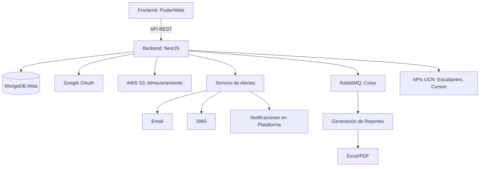

# Diseño Final

**Informe Final Integral: Sistema de Gestión de Ajustes Razonables**

**Programa Incluye UCN-DGE**

**Versión: 2.0**

**Fecha: [Fecha Actual]**

---

### **1. Introducción**

El **Sistema de Gestión de Ajustes Razonables** del Programa Incluye UCN-DGE es una plataforma tecnológica diseñada para centralizar y optimizar la implementación, seguimiento y reportabilidad de ajustes académicos para estudiantes con necesidades educativas especiales (NEE). Este informe integra todas las iteraciones previas del diseño, garantizando una visión unificada y detallada de cada componente, desde la autenticación hasta la generación de reportes.

---

### **2. Arquitectura del Sistema**

### **2.1 Diagrama de Componentes**



### **2.2 Tecnologías Clave**

- **Frontend**: Flutter para aplicaciones móviles y web responsivas.
- **Backend**: NestJS con TypeScript para lógica de negocio.
- **Base de Datos**: MongoDB Atlas (Cluster M30) con sharding por período académico.
- **Autenticación**: Google OAuth 2.0 + JWT para gestión de roles.
- **Almacenamiento**: AWS S3 con cifrado SSE-KMS para documentos sensibles.
- **Colas**: RabbitMQ para procesos asíncronos (reportes, notificaciones).
- **Alertas**: Integración con Twilio (SMS) y WhatsApp Business API.

---

### **3. Autenticación y Gestión de Usuarios**

### **3.1 Flujo de Login con Google OAuth**

1. **Inicio de Sesión**:
    - Usuario ingresa con su cuenta de Google.
    - Backend valida el dominio del correo:
        - **@alumnos.ucn.cl**: Rol **Estudiante**.
        - **@ucn.cl**: Rol **Docente** o **Coordinadora** (según lista interna).
        - **@dea.ucn.cl**, **@aora.ucn.cl**: Rol **Unidad de Apoyo**.
2. **Generación de JWT**:
    - Token incluye: `userId`, `role`, `email`, y permisos asociados.
3. **Colección `users`**:
    
    ```jsx
    {
      _id: ObjectId(),
      googleId: "1035479915971427",
      email: "coordinadora@ucn.cl",
      role: "coordinadora",
      displayName: "Ana López",
      lastLogin: ISODate("2025-04-20"),
      metadata: {
        isActive: true,
        createdAt: ISODate("2025-01-01")
      }
    }
    
    ```
    

### **3.2 Control de Accesos**

- **Middleware de Autorización**:
    
    ```jsx
    // Ejemplo: Solo coordinadoras pueden aprobar ajustes
    router.post("/ajustes/aprobar",
      passport.authenticate("jwt", { session: false }),
      (req, res, next) => {
        if (req.user.role !== "coordinadora") {
          return res.status(403).json({ error: "Acceso denegado" });
        }
        next();
      },
      aprobarAjuste
    );
    
    ```
    

---

### **4. Modelo de Datos Detallado**

### **4.1 Colección `students` (Estudiantes NEE)**

```jsx
{
  _id: ObjectId(),
  rut: "12345678-9",                      // Índice único
  fullName: "María González",
  email: "maria@alumnos.ucn.cl",
  disabilityType: ["visual", "motora"],   // Validado contra lista predefinida
  consent: {
    allowTeachers: true,                  // Acceso general a docentes
    allowedCourses: ["MAT101-1"]          // Cursos con acceso específico
  },
  semesterConfirmations: [{               // Confirmaciones semestrales
    courseNrc: "MAT101-1",
    period: "2025-1",
    adjustmentType: "tiempo_extra",
    confirmed: false,
    deadline: ISODate("2025-04-30"),      // Alineado con calendario académico
    remindersSent: 2
  }],
  metadata: {
    createdAt: ISODate("2025-03-01"),
    updatedAt: ISODate("2025-04-15")
  }
}

```

### **4.2 Colección `adjustments` (Ajustes Razonables)**

```jsx
{
  _id: ObjectId(),
  studentRut: "12345678-9",
  currentAdjustments: [{
    type: "tiempo_extra",
    courseNrc: "MAT101-1",
    approvedBy: "coordinadora@ucn.cl",
    approvedAt: ISODate("2025-04-10"),
    requiresSemesterConfirmation: true,   // Requiere confirmación estudiantil
    expirationDate: ISODate("2025-12-31") // Caducidad del ajuste
  }],
  history: [{
    type: "tiempo_extra",
    status: "aprobado",
    requestedBy: "maria@alumnos.ucn.cl",
    reviewedBy: "coordinadora@ucn.cl",
    timestamp: ISODate("2025-04-10"),
    comments: "Aprobado por alta necesidad"
  }]
}

```

### **4.3 Colección `teacher_access` (Acceso Docente)**

```jsx
{
  _id: ObjectId(),
  teacherRut: "docente1@ucn.cl",
  courseNrc: "MAT101-1",
  period: "2025-1",
  firstAccess: ISODate("2025-04-01"),
  lastAccess: ISODate("2025-04-20"),
  reviewStatus: "no_revisado",            // Estados: "revisado", "no_revisado"
  metadata: {
    notifiedCount: 3,                     // Alertas enviadas
    deadline: ISODate("2025-04-25")
  }
}

```

### **4.4 Colección `communications` (Comunicación entre Unidades)**

```jsx
{
  _id: ObjectId(),
  type: "solicitud_apoyo",
  fromUnit: "DOCENTE",
  toUnit: "DEA",
  studentRut: "12345678-9",
  courseNrc: "MAT101-1",
  message: "Requiero material en braille para el curso",
  attachments: ["s3://ucn-docs/braille.pdf"],
  status: "en_progreso",                  // Estados: "nuevo", "en_progreso", "resuelto"
  priority: "alta",
  metadata: {
    createdAt: ISODate("2025-04-15"),
    updatedAt: ISODate("2025-04-18")
  }
}

```

### **4.5 Colección `surveys` (Encuestas de Seguimiento DIDDEC)**

```jsx
{
  _id: ObjectId(),
  courseNrc: "MAT101-1",
  teacherRut: "docente1@ucn.cl",
  questions: [{
    text: "¿Se implementó el ajuste de tiempo extra?",
    type: "opcion_multiple",
    options: ["Sí", "No", "Parcialmente"],
    response: "Sí"
  }],
  status: "completada",
  deadline: ISODate("2025-05-01"),
  metadata: {
    submittedAt: ISODate("2025-04-28")
  }
}

```

---

### **5. Flujos de Trabajo Principales**

### **5.1 Solicitud y Aprobación de Ajustes**

1. **Solicitud**:
    - Estudiante/docente envía solicitud mediante formulario web.
    - Registro en `adjustments.history` con estado "solicitado".
2. **Revisión**:
    - Coordinadora recibe alerta y revisa la solicitud.
    - Aprueba/rechaza, actualizando `currentAdjustments` y `history`.
3. **Notificación**:
    - Alerta automática a estudiante y docente vía email y plataforma.

### **5.2 Confirmación Semestral de Ajustes**

- **Proceso Automatizado**:
    1. Job mensual verifica `semesterConfirmations.deadline`.
    2. Envía recordatorios a estudiantes con confirmaciones pendientes.
    3. Actualiza `confirmed` tras la respuesta del estudiante.

### **5.3 Seguimiento de Docentes**

- **Alertas**:
    - Si un docente no revisa ajustes en 7 días, se notifica a coordinadora.
    - Incrementa `notifiedCount` en `teacher_access`.

---

### **6. Seguridad y Auditoría**

### **6.1 Cifrado de Datos**

- **En Tránsito**: TLS 1.3 para todas las comunicaciones.
- **En Reposo**:
    - **MongoDB**: Cifrado AES-256 para RUTs y diagnósticos.
    - **AWS S3**: Cifrado SSE-KMS con políticas IAM por carpeta (`certificados/`, `guias/`).

### **6.2 Auditoría**

- **Colección `audit_logs`**:
    
    ```jsx
    {
      action: "actualización_ajuste",
      userRut: "coordinadora@ucn.cl",
      target: "students/12345678-9",
      changes: {
        old: { status: "pendiente" },
        new: { status: "aprobado" }
      },
      timestamp: ISODate("2025-04-20"),
      ip: "192.168.1.100",
      userAgent: "Chrome/114.0.0"
    }
    
    ```
    

### **6.3 Backup y Recuperación**

- **Backups Diarios**:
    - MongoDB Atlas: Snapshots automáticos con retención de 30 días.
    - AWS S3: Versionado habilitado para todos los documentos.
- **Recuperación de Desastres**:
    - RPO (Objetivo de Punto de Recuperación): 1 hora.
    - RTO (Objetivo de Tiempo de Recuperación): 4 horas.

---

### **7. Generación de Reportes**

### **7.1 Tipos de Reportes**

| **Reporte** | **Destinatarios** | **Formato** | **Frecuencia** |
| --- | --- | --- | --- |
| Historial de Ajustes | Coordinadoras | Excel, PDF | Bajo demanda |
| Docentes con Revisiones Pendientes | Jefaturas de Carrera | Excel | Diario |
| Confirmaciones Semestrales | Estudiantes/Coordinadoras | Email | Semanal |
| Encuestas de Seguimiento | DIDDEC | PDF | Mensual |

### **7.2 Proceso de Generación**

1. **Solicitud**: Usuario selecciona parámetros (período, curso, tipo).
2. **Cola de Procesamiento**: RabbitMQ maneja la solicitud asíncronamente.
3. **Generación**:
    - **ExcelJS**: Crea archivos .xlsx con formato predefinido.
    - **PDFMake**: Genera PDFs con gráficos de cumplimiento.
4. **Almacenamiento**: Reporte se guarda en AWS S3 (`s3://ucn-reports/`).
5. **Notificación**: Usuario recibe enlace de descarga por email.

---

### **8. Integración con APIs Universitarias**

### **8.1 Datos desde APIs UCN**

- **Estudiantes**:
    
    ```jsx
    { rut: "12345678-9", fullName: "María González", email: "maria@alumnos.ucn.cl" }
    
    ```
    
- **Cursos**:
    
    ```jsx
    { nrc: "MAT101-1", period: "2025-1", name: "Matemáticas Básicas" }
    
    ```
    
- **Inscripciones**:
    
    ```jsx
    { nrc: "MAT101-1", rut: "12345678-9" }
    
    ```
    

### **8.2 Sincronización Automatizada**

- **Jobs Programados**:
    - Diario: Actualiza estudiantes y cursos desde APIs UCN.
    - Mensual: Sincroniza confirmaciones semestrales con calendario académico.

---

### **9. Comunicación entre Unidades de Apoyo**

### **9.1 Flujo de Solicitud de Acompañamiento**

1. **Docente**: Envía solicitud a través de la plataforma.
2. **DIDDEC**:
    - Recibe alerta y sube recursos a `communications.attachments`.
    - Actualiza estado a "en_progreso".
3. **Notificación**:
    - Unidad de apoyo (ej: DEA) recibe mensaje por WhatsApp/Email.

### **9.2 Integración con WhatsApp Business API**

- **Plantillas de Mensaje**:
    
    ```jsx
    await whatsappService.sendTemplate({
      to: "+56987654321",
      templateName: "solicitud_apoyo",
      parameters: ["MAT101-1", "tiempo_extra"]
    });
    
    ```
    

---

### **10. Pruebas y Validación**

### **10.1 Estrategia de Testing**

- **Unitarias**: Jest para endpoints críticos (login, gestión de ajustes).
- **Integración**: Mocha/Chai para flujos completos (solicitud → aprobación → notificación).
- **Carga**: Artillery para simular 1000 usuarios concurrentes.
- **Seguridad**: OWASP ZAP para identificar vulnerabilidades (XSS, SQLi).

### **10.2 Casos de Prueba Clave**

| **Escenario** | **Resultado Esperado** |
| --- | --- |
| Estudiante sube certificado médico | Documento aparece en `documents` y S3 |
| Docente no revisa ajustes en plazo | Alerta enviada a coordinadora |
| Generación de reporte de 10k registros | Tiempo de respuesta < 30 segundos (vía cola) |

---

### **11. Documentación y Entregables**

### **11.1 Documentación Técnica**

- **Swagger/OpenAPI**: Especificación completa en `/api-docs`.
- **Manual de Usuario**:
    - **Estudiantes**: Confirmación de ajustes, subida de documentos.
    - **Docentes**: Revisión de ajustes, solicitud de acompañamiento.
    - **Coordinadoras**: Aprobación de ajustes, generación de reportes.

### **11.2 Repositorio y CI/CD**

- **GitHub**: Estructura modular con ramas `dev`/`prod`.
- **CI/CD**: GitHub Actions para despliegues automatizados en AWS EKS.
- **Docker**: Contenedores para entornos de desarrollo y testing.

---

### **12. Conclusión y Próximos Pasos**

### **12.1 Logros del Diseño**

- **Integralidad**: Cubre todos los requisitos del documento inicial, incluyendo confirmaciones semestrales, alertas, y reportes.
- **Seguridad**: Cifrado end-to-end y auditoría detallada.
- **Escalabilidad**: Arquitectura modular con capacidad para 100k+ registros.

### **12.2 Próximas Fases**

- **Panel de Métricas**: Integración con Grafana para monitoreo en tiempo real.
- **API de Calendario Académico**: Automatización de fechas límite.
- **Capacitación**: Sesiones técnicas para usuarios finales y administradores.

### **12.3 Equipo y Contacto**

- **Líder del Proyecto**: [Nombre y Correo]
- **Equipo de Desarrollo**: [Nombres y Roles]
- **Repositorio**: [Enlace a GitHub]
- **Documentación**: [Enlace a Confluence/Swagger]

---

**Fin del Informe**

**© Programa Incluye UCN-DGE - 2025**

---

Este informe consolida todas las iteraciones previas, garantizando una visión holística y detallada del sistema, desde la infraestructura técnica hasta los flujos de usuario final.