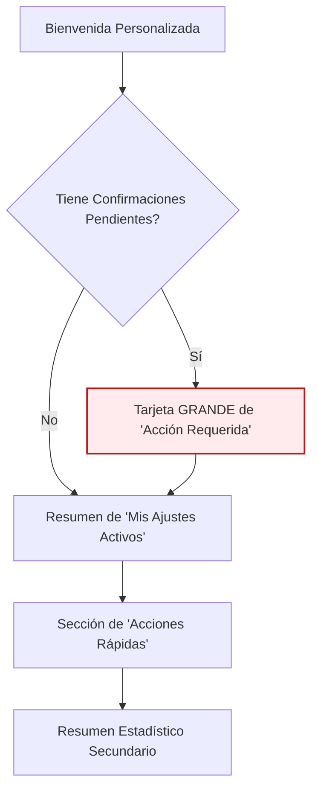

# 🎨 Diseño de Vista: Dashboard del Estudiante

**📅 Fecha de Diseño:** 06 de Julio 2025
**👤 Rol:** Estudiante
** principali Vista:** `EstudianteDashboard`

---

## 1. Análisis del Rol y Objetivos del Usuario (JTBD)

Un estudiante que utiliza la aplicación necesita:
1.  **Saber inmediatamente si tiene tareas pendientes** que requieran su acción (ej. "Confirmar la recepción de un ajuste").
2.  **Consultar fácilmente qué ajustes tiene activos** para sus asignaturas en el semestre actual.
3.  **Acceder rápidamente a sus cursos** y a la información de su perfil.
4.  Entender el estado general de sus apoyos sin sentirse abrumado por datos.

## 2. Jerarquía de Información y Diseño del Layout

La vista se estructurará verticalmente para guiar al usuario a través de un flujo lógico, de lo más urgente a lo más informativo.

### **Componente 1: Tarjeta de Acción Requerida (Máxima Prioridad)**

-   **Visibilidad:** Solo aparece si `_pendingConfirmations > 0`.
-   **Diseño:**
    -   Un `Card` con un `backgroundColor` de `AppColors.alertStatCard` para llamar la atención.
    -   Un ícono grande (`Icons.warning` o `Icons.notification_important`).
    -   Texto claro y directo: **"Tienes X confirmaciones pendientes."**
    -   Un `ElevatedButton` prominente: **"Revisar ahora"**.
-   **Objetivo:** Canalizar al usuario hacia la tarea más crítica sin distracciones.

### **Componente 2: Mis Ajustes Activos (Información Primaria)**

-   **Visibilidad:** Siempre visible (a menos que no tenga ajustes).
-   **Diseño:**
    -   Un `Card` con un título claro: "Mis Ajustes Activos".
    -   Si no hay ajustes, mostrar un mensaje amigable (Estado Vacío): "No tienes ajustes activos para este semestre."
    -   Si hay ajustes, mostrar un `ListView` (o `Column`) de `ListTile`. Cada `ListTile` mostrará:
        -   `leading`: Ícono representando el tipo de ajuste.
        -   `title`: Nombre del ajuste (ej. "Tiempo Adicional 50%").
        -   `subtitle`: Nombre de la asignatura (ej. "Cálculo I").
-   **Objetivo:** Permitir al estudiante verificar sus apoyos de forma rápida y clara.

### **Componente 3: Acciones Rápidas**

-   **Diseño:** Una fila horizontal (`Row`) de 2 o 3 `QuickActionButton`.
-   **Acciones:**
    1.  **"Mis Cursos"**: Navega a la lista de cursos.
    2.  **"Mi Perfil"**: Navega a la pantalla de perfil del estudiante.
    3.  **(Opcional) "Solicitar Ayuda"**: Abre un diálogo o pantalla para contactar a DIDDEC/Incluye.

### **Componente 4: Resumen Estadístico (Prioridad Baja)**

-   **Diseño:** Una única `StatisticCard` o un `Card` simple con texto.
-   **Contenido:** Información de bajo impacto en el día a día.
    -   "Estás inscrito/a en **X** cursos este semestre."
    -   "Tienes un historial de **Y** ajustes completados."
-   **Objetivo:** Ofrecer contexto sin robar protagonismo a la información importante.

## 3. Manejo de Estados

-   **Carga:** Un `CircularProgressIndicator` centrado ocupará toda la pantalla mientras `_isLoading` es `true`.
-   **Error:** Se mostrará un `SnackBar` con el mensaje de error, como ya está implementado.
-   **Vacío:** El componente "Mis Ajustes Activos" manejará su propio estado vacío internamente, como se describió anteriormente. 