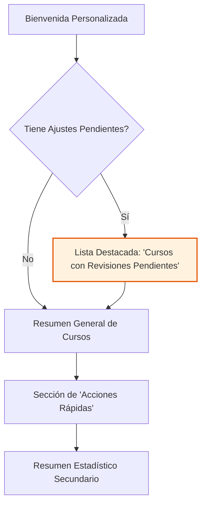

# 🎨 Diseño de Vista: Dashboard del Docente

**📅 Fecha de Diseño:** 06 de Julio 2025
**👤 Rol:** Docente
** principali Vista:** `DocenteDashboard`

---

## 1. Análisis del Rol y Objetivos del Usuario (JTBD)

Un docente que utiliza la aplicación necesita:
1.  **Identificar rápidamente qué cursos tienen estudiantes con ajustes pendientes** de revisar o implementar. Esta es su tarea más crítica y sensible al tiempo.
2.  **Acceder de forma sencilla a la lista completa de sus cursos** y a los estudiantes con NEE en cada uno.
3.  **Tener una vía de comunicación clara para solicitar ayuda** a DIDDEC o Incluye si tiene dudas sobre un ajuste.
4.  Ver un resumen de su carga académica relacionada con estudiantes con NEE.

## 2. Jerarquía de Información y Diseño del Layout

El layout se centrará en la gestión de cursos, priorizando aquellos que requieren acción inmediata.

### **Componente 1: Cursos con Revisiones Pendientes (Máxima Prioridad)**

-   **Visibilidad:** Solo aparece si `_pendingAdjustments > 0`.
-   **Diseño:**
    -   Un `Card` con un título claro: **"Acción Requerida: Revisiones Pendientes"**.
    -   Dentro del card, una `Column` o `ListView` de un nuevo widget reutilizable: `CourseActionCard`.
    -   **`CourseActionCard`**:
        -   `title`: Nombre del curso (ej. "Cálculo I").
        -   `subtitle`: "X ajustes pendientes de revisar".
        -   `trailing`: Un botón "Enviar notificación interna" que envía una alerta al docente desde la plataforma. Opcionalmente, un botón "Marcar como contactado" para registro interno.
        -   (Opcional) Un botón "Exportar lista" para que el jefe/coordinador pueda descargar la lista de docentes con atrasos y contactarlos manualmente por correo externo si lo desea.
-   **Objetivo:** Enfocar al docente directamente en los cursos que necesitan su atención y facilitar el seguimiento sin depender de correo automático externo.

### **Componente 2: Resumen General de Cursos (Información Primaria)**

-   **Visibilidad:** Siempre visible.
-   **Diseño:**
    -   Un `Card` con el título "Mis Cursos".
    -   Si no hay cursos, un mensaje de estado vacío.
    -   Si hay cursos, una lista simple (`ListTile`) que muestra los nombres de los cursos. Un `onTap` en cada uno lleva a los detalles del curso.
-   **Objetivo:** Proveer un acceso rápido a la lista completa de sus asignaturas.

### **Componente 3: Acciones Rápidas**

-   **Diseño:** Una `Row` con 2-3 `QuickActionButton`.
-   **Acciones:**
    1.  **"Lista de Estudiantes NEE"**: Navega a una pantalla que lista todos sus estudiantes con NEE, agrupados por curso.
    2.  **"Solicitar Ayuda"**: Abre un diálogo pre-configurado para enviar una consulta.
    3.  **"Ver Historial"**: Navega a un historial de todos los ajustes que ha gestionado.

### **Componente 4: Resumen Estadístico (Prioridad Baja)**

-   **Diseño:** Una `GridView` de 2 columnas con `StatisticCard`, como estaba antes, pero ahora relegada a una posición secundaria.
-   **Contenido:**
    -   Total de Cursos.
    -   Total de Estudiantes NEE.
    -   Total de Ajustes Históricos.
-   **Objetivo:** Proporcionar una vista cuantitativa general sin interferir con las tareas principales.

## 3. Manejo de Estados

-   **Carga y Error:** Se manejarán de la misma forma que en el `EstudianteDashboard` (Indicador de progreso y SnackBar).
-   **Vacío:** Los componentes de listas manejarán sus propios estados vacíos con mensajes claros y amigables. 