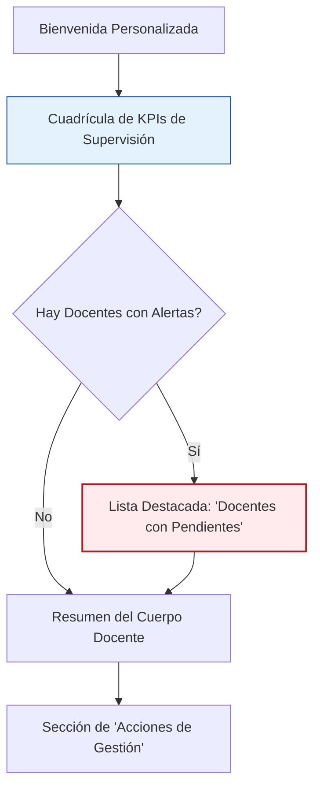

# 🎨 Diseño de Vista: Dashboard de Jefatura de Carrera

**📅 Fecha de Diseño:** 06 de Julio 2025
**👤 Rol:** Jefe de Carrera
** principali Vista:** `JefaturaDashboard`

---

## 1. Análisis del Rol y Objetivos del Usuario (JTBD)

Un Jefe de Carrera utiliza la aplicación para:
1.  **Supervisar el estado general** de los ajustes razonables dentro de los cursos de su carrera.
2.  **Detectar anomalías o incumplimientos**, especialmente docentes que no están revisando los ajustes a tiempo.
3.  **Acceder a reportes y estadísticas** sobre el desempeño de su unidad académica en materia de inclusión.
4.  **Gestionar la asignación de docentes** a los cursos y ver su carga de trabajo relacionada con NEE.

Su rol es más de **supervisión y gestión estratégica** que de operación diaria.

## 2. Jerarquía de Información y Diseño del Layout

El layout priorizará los indicadores clave (KPIs) y las alertas que requieran su atención como supervisor.

### **Componente 1: Cuadrícula de KPIs de Supervisión (Máxima Prioridad)**

-   **Visibilidad:** Siempre al inicio. Para este rol, los números agregados son la información principal.
-   **Diseño:**
    -   Una `GridView` con 2x2 `StatisticCard`.
    -   **KPI 1 (Alerta): "Revisiones Fuera de Plazo"**. Usará `AppColors.alertStatCard`. Un número mayor a cero aquí es la principal señal de alarma.
    -   **KPI 2 (Aviso): "Docentes con Pendientes"**. Usará `AppColors.pendingStatCard`. Indica cuántos docentes tienen trabajo por hacer.
    -   **KPI 3 (Informativo): "Estudiantes NEE en la Carrera"**. Usará `AppColors.activeStatCard`.
    -   **KPI 4 (Informativo): "Total Cuerpo Docente"**. Usará `AppColors.totalStatCard`.
-   **Objetivo:** Ofrecer un panorama cuantitativo inmediato del estado de la carrera.

### **Componente 2: Lista de Docentes con Alertas (Información Accionable)**

-   **Visibilidad:** Solo aparece si hay docentes con ajustes pendientes o fuera de plazo.
-   **Diseño:**
    -   Un `Card` con el título: **"Seguimiento Requerido"**.
    -   Una lista de `ListTile`. Cada `ListTile` representará a un docente:
        -   `leading`: `CircleAvatar` con las iniciales del docente.
        -   `title`: Nombre del docente.
        -   `subtitle`: "X revisiones pendientes, Y fuera de plazo".
        -   `trailing`: Un botón "Enviar notificación interna" que envía una alerta al docente desde la plataforma. Opcionalmente, un botón "Marcar como contactado" para registro interno.
        -   (Opcional) Un botón "Exportar lista" para que el jefe/coordinador pueda descargar la lista de docentes con alertas y contactarlos manualmente por correo externo si lo desea.
-   **Objetivo:** Permitir al Jefe de Carrera identificar rápidamente a los individuos que necesitan seguimiento y facilitar la acción sin depender de correo automático externo.

### **Componente 3: Acciones de Gestión**

-   **Diseño:** Una `Row` o `Column` con botones de acción claros.
-   **Acciones:**
    1.  **"Gestionar Cuerpo Docente"**: Navega a una pantalla para ver la lista completa de docentes, sus cursos asignados y estadísticas individuales.
    2.  **"Generar Reportes"**: Navega a la sección de reportes de cumplimiento (funcionalidad de Fase 3 del roadmap, el botón puede estar deshabilitado inicialmente).

### **Componente 4: Resumen del Cuerpo Docente**

-   **Visibilidad:** Siempre visible, debajo de las alertas.
-   **Diseño:** Un `Card` con una lista simple de los docentes de la carrera, para tener una referencia visual rápida.

## 3. Manejo de Estados

-   Se seguirán los mismos principios de manejo de estados de Carga, Error y Vacío definidos en las guías generales de UX/UI. 