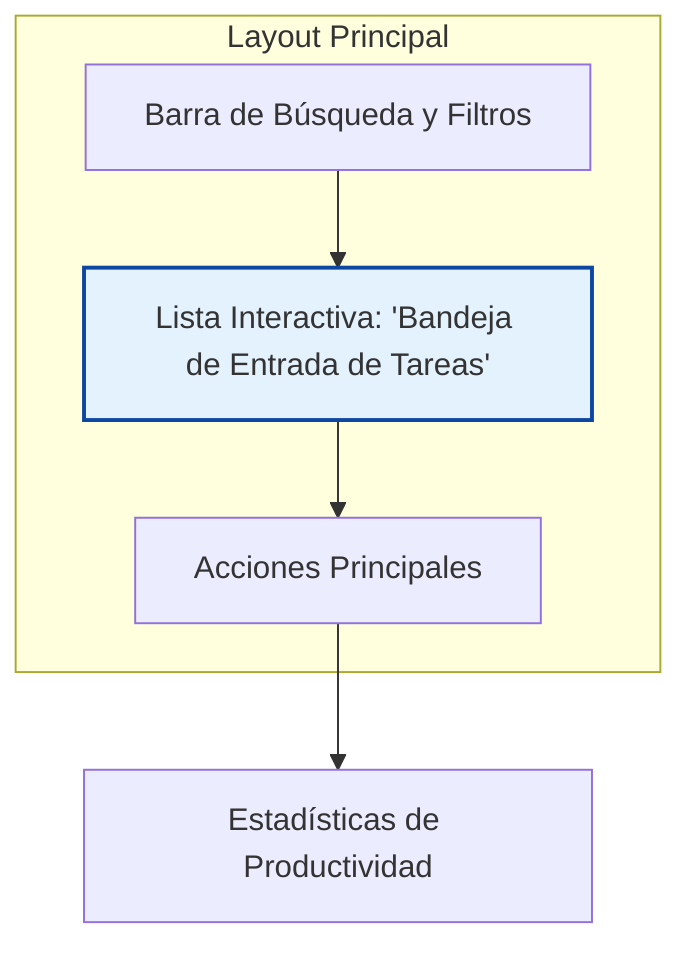

# 🎨 Diseño de Vista: Dashboard de DIDDEC

**📅 Fecha de Diseño:** 06 de Julio 2025
**👤 Rol:** DIDDEC (Staff de Apoyo)
** principali Vista:** `DiddecDashboard`

---

## 1. Análisis del Rol y Objetivos del Usuario (JTBD)

El personal de DIDDEC es un operador del sistema cuya función principal es la gestión activa de tareas. Necesitan:
1.  **Procesar una cola de trabajo:** Su tarea principal es atender las solicitudes pendientes, como la validación de recursos o la respuesta a solicitudes de ayuda.
2.  **Gestionar el catálogo de recursos** de apoyo (documentos, guías, etc.).
3.  **Buscar rápidamente a un estudiante** o un caso específico para darle seguimiento.
4.  **Generar reportes** sobre el uso de recursos y los tiempos de respuesta.

Su dashboard debe ser una **herramienta de productividad**, no un panel de visualización pasivo.

## 2. Jerarquía de Información y Diseño del Layout

El layout se diseñará como un "inbox" o una "mesa de trabajo", priorizando las tareas accionables sobre las métricas numéricas.

### **Componente 1: Bandeja de Entrada de Tareas (Layout Principal)**

-   **Visibilidad:** Ocupa la mayor parte de la pantalla. Reemplaza por completo la `GridView` de estadísticas.
-   **Diseño:**
    -   Un `ListView.builder` para la eficiencia.
    -   Cada ítem de la lista será un `TaskCard` (nuevo widget reutilizable) que contendrá:
        -   Un ícono indicando el tipo de tarea (ej: `Icons.upload_file` para un recurso, `Icons.help` para una solicitud de ayuda).
        -   Un título claro: "Validación de Recurso Pendiente" o "Solicitud de Ayuda de [Nombre Docente]".
        -   Un subtítulo con el nombre del estudiante o curso asociado.
        -   Una etiqueta de prioridad o fecha de ingreso.
        -   Un `onTap` que navega directamente a la pantalla para resolver esa tarea.
-   **Estado Vacío:** Si no hay tareas, se mostrará un mensaje motivador: "¡Bandeja de entrada limpia! Buen trabajo."
-   **Objetivo:** Convertir el dashboard en un centro de acción claro y eficiente.

### **Componente 2: Barra de Búsqueda y Filtros**

-   **Visibilidad:** En la parte superior, integrada con el `AppBar` o justo debajo.
-   **Diseño:** Un `TextField` con decoración de búsqueda y un `IconButton` para abrir un menú de filtros (ej. filtrar por tipo de tarea, por fecha, etc.).
-   **Objetivo:** Permitir a DIDDEC encontrar casos específicos rápidamente sin tener que navegar por múltiples pantallas.

### **Componente 3: Acciones Principales (Floating Action Button o Barra Inferior)**

-   **Diseño:** En lugar de `QuickActionButton` en el cuerpo del scroll, se usarán patrones de diseño más prominentes para acciones de creación.
    -   Un `FloatingActionButton` (FAB) con `Icons.add` que, al ser presionado, abre un menú (`SpeedDial`) con opciones: "Subir Recurso", "Crear Notificación Global".
    -   Alternativamente, un `BottomNavigationBar` si las acciones son más de 3.
-   **Objetivo:** Hacer que las acciones de creación sean accesibles desde cualquier punto de la lista sin necesidad de hacer scroll.

### **Componente 4: Estadísticas de Productividad**

-   **Visibilidad:** Se mueven a una pantalla secundaria, accesible a través de un `IconButton` en el `AppBar` (`Icons.bar_chart`).
-   **Contenido:** La `GridView` de `StatisticCard` con métricas como "Casos resueltos hoy", "Tiempo de respuesta promedio", etc., vivirá en esta nueva pantalla de "Reportes de Productividad".
-   **Objetivo:** Mantener el dashboard de trabajo limpio y enfocado, separando la acción de la analítica.

## 3. Manejo de Estados

-   Se seguirán los mismos principios de Carga, Error y Vacío definidos en las guías generales. El estado vacío de la bandeja de entrada es un estado funcional clave. 