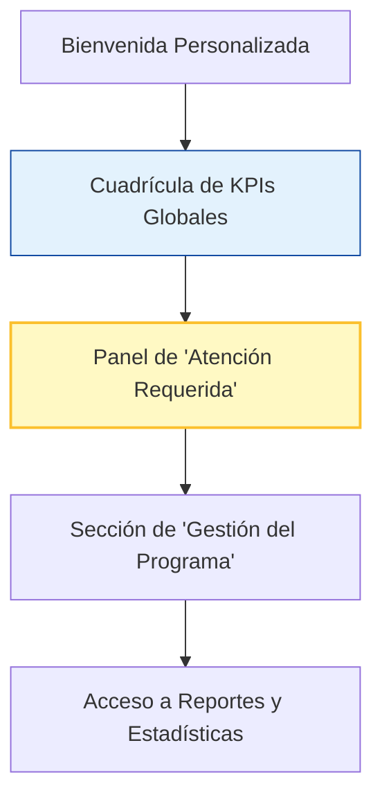

# 🎨 Diseño de Vista: Dashboard de Incluye (Coordinación)

**📅 Fecha de Diseño:** 06 de Julio 2025
**👤 Rol:** Incluye (Coordinadora / Gestor Principal)
** principali Vista:** `IncluyeDashboard`

---

## 1. Análisis del Rol y Objetivos del Usuario (JTBD)

El rol de Incluye es el administrador principal del sistema. Sus necesidades son una combinación de supervisión, gestión y configuración. Necesitan:
1.  **Tener una visión ejecutiva del estado del programa** a nivel de toda la institución.
2.  **Identificar cuellos de botella o problemas sistémicos** (ej. un gran número de docentes con atrasos, muchos estudiantes sin confirmar).
3.  **Realizar acciones de gestión de alto nivel** que son centrales para el funcionamiento del programa, como registrar nuevos estudiantes en el sistema o configurar los parámetros del semestre.
4.  **Gestionar los roles y permisos** de los demás usuarios.

Su dashboard es un **centro de comando estratégico**.

## 2. Jerarquía de Información y Diseño del Layout

El layout debe balancear una vista de "ojo de halcón" con acceso directo a herramientas de gestión críticas.

### **Componente 1: Cuadrícula de KPIs Globales (Visión Ejecutiva)**

-   **Visibilidad:** Siempre en la parte superior. Es el pulso del programa.
-   **Diseño:**
    -   Una `GridView` con 2x2 o 2x3 `StatisticCard`.
    -   **KPI 1: "Total Estudiantes NEE"**.
    -   **KPI 2: "Total Ajustes Activos"**.
    -   **KPI 3: "Nuevos Estudiantes (Semestre)"**.
    -   **KPI 4 (Alerta): "Alertas Globales"** (agregado de docentes con atrasos, estudiantes sin confirmar, etc.).
-   **Objetivo:** Proporcionar una comprensión inmediata y cuantitativa del estado del programa.

### **Componente 2: Panel de "Atención Requerida" (Focos de Problema)**

-   **Visibilidad:** Siempre visible debajo de los KPIs.
-   **Diseño:**
    -   Un `Card` con el título "Focos de Atención".
    -   Dentro, una `Column` con `ListTile` que resumen problemas, en lugar de listarlos todos.
    -   **Ejemplo de `ListTile` 1:**
        -   `leading`: `Icon(Icons.warning, color: AppColors.alertStatText)`
        -   `title`: "Docentes con Revisiones Vencidas"
        -   `subtitle`: "X docentes no han revisado ajustes fuera de plazo."
        -   `trailing`: Un botón "Enviar notificación interna" para alertar a los docentes desde la plataforma. (Opcional) Un botón "Exportar lista" para contacto manual externo si se requiere.
    -   **Ejemplo de `ListTile` 2:**
        -   `leading`: `Icon(Icons.person_search, color: AppColors.pendingStatText)`
        -   `title`: "Estudiantes sin Confirmación"
        -   `subtitle`: "Y estudiantes aún no confirman sus ajustes para este semestre."
        -   `trailing`: Un botón "Enviar notificación interna" para alertar a los estudiantes desde la plataforma. (Opcional) Un botón "Exportar lista" para contacto manual externo si se requiere.
-   **Objetivo:** Permitir al coordinador identificar problemas sistémicos y actuar mediante notificaciones internas, sin depender de correo automático externo.

### **Componente 3: Sección de "Gestión del Programa" (Acciones Críticas)**

-   **Diseño:** Una sección claramente delimitada con `QuickActionButton` para las tareas más importantes y exclusivas de este rol.
-   **Acciones:**
    1.  **"Registrar Estudiante"**: La puerta de entrada al sistema para nuevos estudiantes.
    2.  **"Gestionar Usuarios"**: Navega a la pantalla de administración de roles y permisos.
        -   **Detalle de la pantalla "Gestionar Usuarios":**
            -   Debe permitir buscar a cualquier usuario registrado por nombre o email.
            -   Al seleccionar un usuario, se debe mostrar su perfil básico y una lista de sus roles actuales.
            -   Debe ofrecer una opción para "Editar Roles", que permita a la Coordinadora añadir o quitar roles (Jefe de Carrera, Docente, etc.) a ese usuario. Esta acción consumirá el nuevo endpoint `PATCH /users/:id/roles`.
    3.  **"Configurar Semestre"**: Navega a la pantalla para definir las fechas clave del semestre académico.

### **Componente 4: Acceso a Reportes y Estadísticas**

-   **Diseño:** Un `Card` o un botón prominente al final de la vista.
-   **Acción:** "Ver todos los reportes", que navega a una nueva pantalla de `ReportsDashboard` donde se podrán generar y exportar datos de cumplimiento, uso, etc. (funcionalidad de Fase 3).

## 3. Manejo de Estados

-   Se seguirán los mismos principios de Carga, Error y Vacío definidos en las guías generales. 