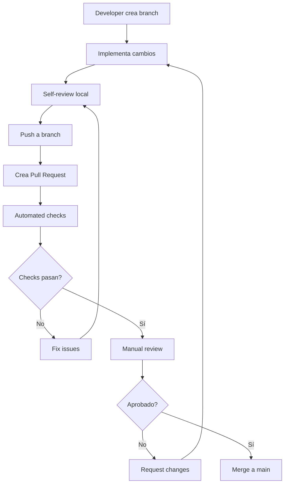

# ✅ CODE REVIEW - Estándares y Checklist
## Proyecto: Plataforma Inclusiva UCN

### 📅 **Última Actualización**: 21 Diciembre 2025
### 🎯 **Objetivo**: Mantener altos estándares de calidad y prevenir regresiones en futuras versiones.

---

## ✅ **LECCIONES APLICADAS EN LA ESTABILIZACIÓN DE V1.0**

El proceso de estabilización para la V1.0 resolvió varios problemas críticos. Este checklist de Code Review está diseñado para asegurar que estos problemas no se reintroduzcan en el futuro.

### **Problemas que el Proceso de Calidad Resolvió:**
1. ✅ **Archivo duplicado**: `user.decorator 2.ts` fue eliminado.
2. ✅ **Implementaciones placeholder**: `findByDepartment()` y otros métodos fueron implementados.
3. ✅ **Enums duplicados**: Se unificó el sistema de roles y se eliminaron definiciones redundantes.
4. ✅ **Exception handling**: Se estandarizó el uso de las excepciones de NestJS.
5. 🅿️ **Violación SRP**: `AdjustmentsService` se marcó para refactoring en V2, aunque es funcional.

---

## 📋 **CHECKLIST DE CODE REVIEW**

### **🔍 Revisión Automática (Pre-commit)**
```bash
# Verificaciones que deben pasar ANTES del commit
[ ] ESLint sin errores
[ ] Prettier aplicado
[ ] Tests unitarios pasan
[ ] Build exitoso sin warnings
[ ] No console.log() en código
```

### **👀 Revisión Manual (Pull Request)**

#### **📁 Archivos y Estructura**
```typescript
[ ] Sin archivos duplicados (verificar nombres similares)
[ ] Nombres de archivos siguen convención kebab-case
[ ] Imports organizados (externos -> internos -> relativos)
[ ] Exports al final del archivo
[ ] Sin archivos temporales (.tmp, .bak, etc.)
```

#### **🏗️ Arquitectura y Diseño**
```typescript
[ ] Servicios < 300 líneas (Split si es mayor)
[ ] Controladores < 200 líneas
[ ] Máximo 1 responsabilidad por clase/servicio
[ ] Sin dependencias circulares
[ ] DTOs bien definidos (sin 'any' excesivo)
```

#### **🔐 Seguridad y Roles**
```typescript
[ ] @Roles() decorators específicos (no generic)
[ ] Validación de permisos en endpoints sensibles
[ ] Sanitización de inputs
[ ] No datos sensibles en logs
[ ] Guards aplicados consistentemente
```

#### **⚡ Performance y Queries**
```typescript
[ ] Queries MongoDB optimizadas
[ ] Paginación en endpoints que retornan listas
[ ] Sin N+1 query problems
[ ] Índices considerados para nuevas queries
[ ] Agregaciones eficientes
```

#### **🎯 Funcionalidad**
```typescript
[ ] Métodos implementados completamente (no placeholders)
[ ] Exception handling con NestJS exceptions
[ ] Validación de parámetros de entrada
[ ] Casos edge considerados
[ ] Logging apropiado para debugging
```

#### **📚 Documentación**
```typescript
[ ] Swagger decorators en endpoints nuevos
[ ] Comentarios JSDoc en métodos complejos
[ ] README actualizado si hay cambios significativos
[ ] Guías técnicas actualizadas
```

#### **🧪 Testing**
```typescript
[ ] Tests unitarios para nuevos métodos
[ ] Tests de integración para endpoints
[ ] Mocks apropiados para dependencias
[ ] Coverage no disminuye
[ ] Tests descriptivos y mantenibles
```

---

## 🔄 **PROCESO DE CODE REVIEW**

### **Flujo Obligatorio**


### **Roles y Responsabilidades**

#### **👨‍💻 Developer (Autor)**
- **Self-review** antes de crear PR
- **Responder** a comentarios en < 24h
- **Testear** localmente todos los cambios
- **Actualizar** documentación relevante

#### **👨‍🏫 Reviewer (Compañero)**
- **Review** en < 48h de creación del PR
- **Dar feedback constructivo** y específico
- **Verificar** que checklist se cumple
- **Aprobar** solo si está 100% seguro

#### **🎯 Tech Lead (Fabian)**
- **Review final** para cambios arquitecturales
- **Resolución** de conflictos en reviews
- **Mantenimiento** de estándares del proyecto
- **Actualización** de guías y procesos

---

## ⚠️ **CRITERIOS DE BLOQUEO**

### **🚫 Merge Prohibido Si:**
```typescript
// CRÍTICOS - Bloqueo inmediato
[ ] Build falla
[ ] Tests unitarios fallan
[ ] Linter con errores (no warnings)
[ ] Archivos duplicados detectados
[ ] Implementaciones placeholder (return [])

// ALTOS - Requiere fix antes de merge
[ ] Exception handling inconsistente
[ ] Sin @Roles() en endpoints protegidos
[ ] Servicios > 300 líneas sin justificación
[ ] Queries ineficientes evidentes
[ ] No hay tests para nueva funcionalidad

// MEDIOS - Puede mergearse con issue de seguimiento
[ ] Documentación faltante
[ ] Warnings de linter menores
[ ] Coverage de tests disminuye ligeramente
[ ] Comentarios obsoletos
```

---

## 📝 **TEMPLATES DE REVIEW**

### **Template de PR Description**
```markdown
## 🎯 Objetivo
Breve descripción de qué resuelve este PR

## 🔄 Cambios Realizados
- [ ] Cambio 1
- [ ] Cambio 2

## 🧪 Testing
- [ ] Tests unitarios agregados/actualizados
- [ ] Testing manual realizado
- [ ] Regression testing OK

## 📚 Documentación
- [ ] Swagger actualizado
- [ ] Guías técnicas actualizadas
- [ ] README modificado (si aplica)

## 🔗 Issues Relacionados
Fixes #123, Related to #456

## 📊 Checklist Pre-Review
- [ ] Self-review completado
- [ ] Build local exitoso
- [ ] Linter sin errores
- [ ] Tests locales pasan
```

### **Template de Review Comments**
```markdown
# ✅ Aprobación
Excelente trabajo! El código cumple todos los estándares.

# 🔄 Request Changes  
Necesita cambios antes de merge:
1. **Crítico**: [Descripción específica]
2. **Alto**: [Descripción específica]

# 💭 Suggestions
Sugerencias opcionales para mejorar:
- **Performance**: [Sugerencia específica]
- **Legibilidad**: [Sugerencia específica]
```

---

## 🎯 **CASOS ESPECIALES**

### **Hotfixes Críticos**
```typescript
// Para problemas de producción críticos
// Se permite bypass de review CON:
[ ] Testing exhaustivo local
[ ] Notificación inmediata al equipo
[ ] Review post-merge en < 2h
[ ] Documentación del incidente
```

### **Refactoring Masivo**
```typescript
// Para cambios grandes como AdjustmentsService
[ ] Plan de refactoring documentado
[ ] Review en múltiples PRs pequeños
[ ] Testing incremental por componente
[ ] Feature flags si es necesario
[ ] Rollback plan preparado
```

### **Cambios de Configuración**
```typescript
// Para .env, package.json, etc.
[ ] Testing en ambiente de desarrollo
[ ] Documentación de variables nuevas
[ ] Backward compatibility considerada
[ ] Instrucciones de despliegue actualizadas
```

---

## 📊 **MÉTRICAS DE CALIDAD**

### **Objetivos del Equipo**
- **Review Time**: < 48h promedio
- **Approval Rate**: > 85% al primer review
- **Rework Rate**: < 15% de PRs requieren cambios
- **Critical Issues**: 0 problemas críticos en producción

### **Red Flags para Monitoring**
```typescript
// Indicadores de que el proceso no funciona
🚨 PRs grandes (> 500 líneas) frecuentes
🚨 Reviews que toman > 1 semana
🚨 Mismo tipo de issues repetidos
🚨 Hotfixes frecuentes por bugs
🚨 Tests que fallan regularmente
```

---

## 🛠️ **TOOLS Y AUTOMATION**

### **GitHub/GitLab Setup**
```yaml
# .github/workflows/pr-checks.yml
name: PR Checks
on: [pull_request]
jobs:
  checks:
    runs-on: ubuntu-latest
    steps:
      - uses: actions/checkout@v2
      - name: Install dependencies
        run: npm ci
      - name: Lint
        run: npm run lint
      - name: Test
        run: npm run test
      - name: Build
        run: npm run build
```

### **VSCode Extensions Recomendadas**
```json
{
  "recommendations": [
    "esbenp.prettier-vscode",
    "ms-vscode.vscode-typescript-next",
    "bradlc.vscode-tailwindcss",
    "ms-vscode.vscode-jest"
  ]
}
```

---

## 🎓 **TRAINING Y ONBOARDING**

### **Para Nuevos Developers**
1. **Leer** todas las guías técnicas (`/guias/`)
2. **Review** ejemplos de good/bad code
3. **Hacer** shadow review de 3-5 PRs
4. **Recibir** review detallado en primeros PRs

### **Para Reviewers Nuevos**
1. **Entender** el negocio y stakeholders
2. **Conocer** arquitectura y patrones del proyecto
3. **Practicar** con PRs de baja criticidad
4. **Escalar** dudas al Tech Lead

---

## 📈 **CONTINUOUS IMPROVEMENT**

### **Retrospectivas Mensuales**
- ¿Qué issues se repiten frecuentemente?
- ¿El proceso es demasiado lento/rápido?
- ¿Necesitamos más automation?
- ¿Los estándares son claros y aplicables?

### **Evolución de Estándares**
- **Actualizar** checklist basado en issues reales
- **Agregar** tools que automaticen verificaciones
- **Refinar** criterios de bloqueo según experiencia
- **Mantener** guías sincronizadas con código

---

> **💡 Nota**: Este documento debe evolucionar basado en la experiencia del equipo. Cada problema encontrado en producción debe traducirse en un item del checklist para prevenir recurrencia. 

# Code Review Guide 